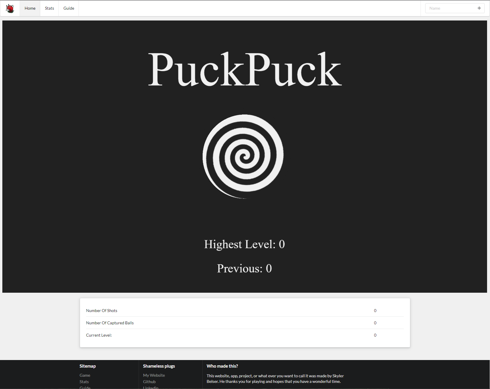

# PuckPuck - Game

    

You can play the game [HERE](https://puckme.herokuapp.com/)

Strategically launch pucks around a board while managing their reflective vectors in order to hit a target. If the timer hits zero you loss. You start with twenty seconds, and can earn more by succesfully landing pucks in the target and clearing the level. Be ware though that each level is harder then the last.

## What was used
* PixiJS
* Matter.js
* Node.js
* MongoDB
* Semantic UI
